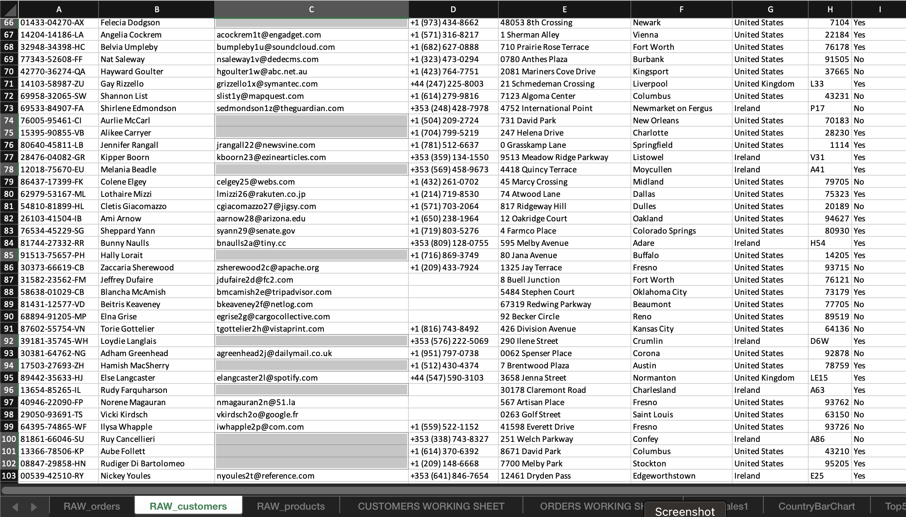
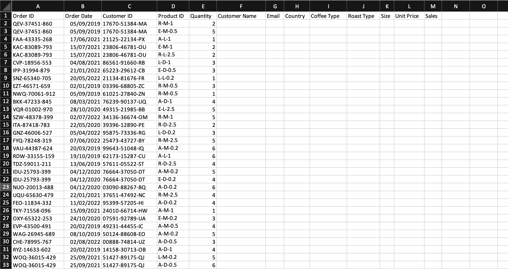
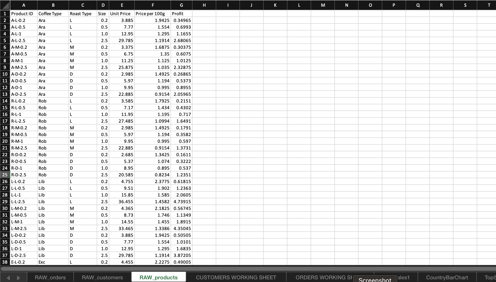
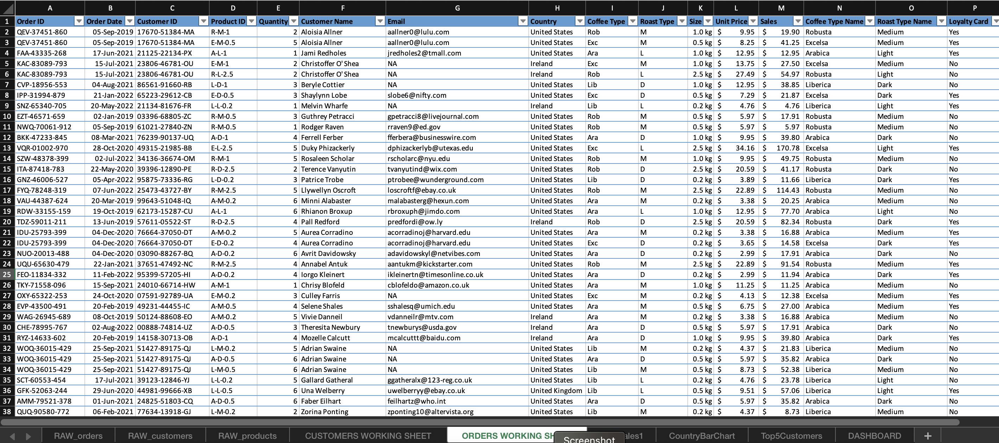
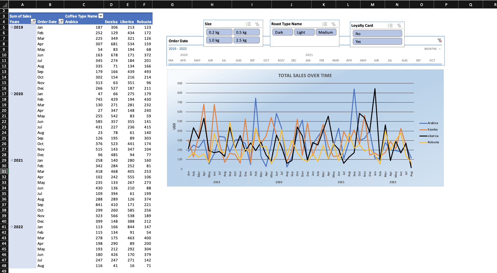
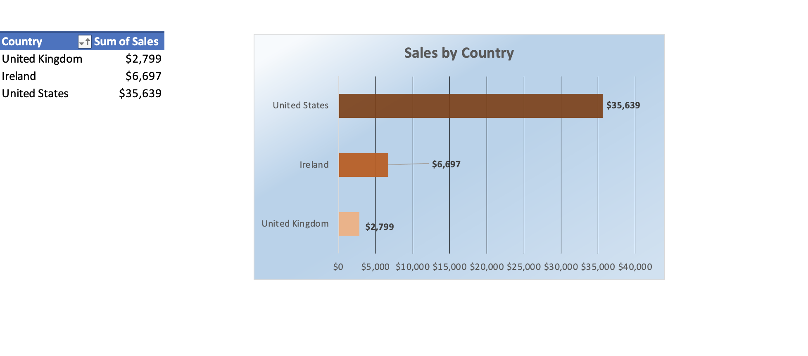
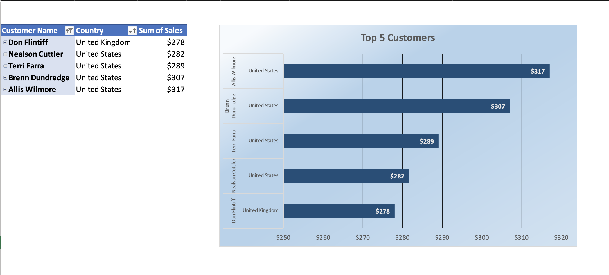
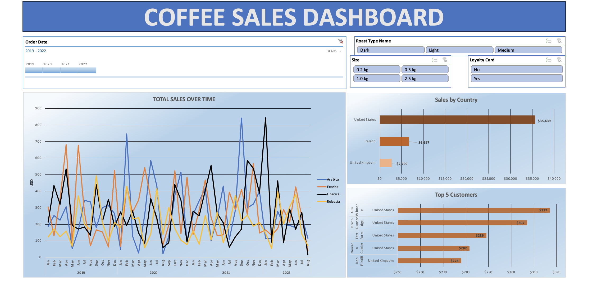

# Coffee Orders Dashboard

---

## Introduction
This is an Excel project on the sales analysis of an imaginary **coffee-selling** company from 2019-2022.
The project is to create a dashboard and derive insights to answer crucial questions regarding the sales of the coffee types and help the store make data-driven decisions.
**_Disclaimer_**: _All datasets and reports do not represent any company, institution or country, but just a dummy dataset to demonstrate the capabilities of Microsoft Excel._

## Problem statement
1. What is the total sales over time?
2. What are the sales by each country?
3. Who are the top 5 customers?
4. What are the sales by the coffee type, size, and customer loyalty?

## Dataset
1. Customers
2. Orders
3. Products

### Raw datasets

## Data cleaning

Clean the data by:

- replacing blank cells with NA, formatting the date, checking for duplicate values
- changing the data type of some values within a column using the IF and IFs formulas and
- formatting the sheets into Tables

## Data Modelling

- Create a final data set by merging the three tables together.
- Using the **Orders table** as my base table, I first joined the relevant columns from the Customers data set and then the Products Types data set with XLookUp.
- Figured out the total sales, sales by each country, and sales by coffee types using Pivot Table and Pivot Charts.

### Final dataset with the base table

## Visualisation
The models are derived from the Pivot Table and Slicers and analysed using Pivot Chart Analysis.

### Total Sales over time

### Sales by each country

### Top 5 Customers

### Coffee Sales Overall Dashboard

## Analysis and Insights

1. The majority of sales are concentrated in the United States, followed by Ireland and the United Kingdom. This suggests that the United States is a key market for the coffee company.
2. The top 5 customers have notable sales figures. The company may want to focus on retaining and nurturing relationships with these high-value customers.
3. The dashboard will help the company to track geographical sales analysis, customer contribution, regional sales performance, average sales per customer, product performance, seasonal trends, sales forecasting and competitor benchmarking among others.
---

